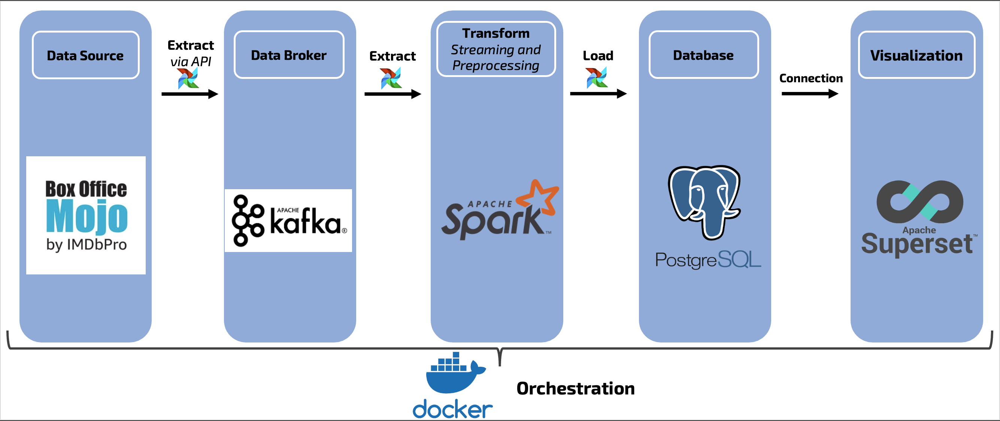
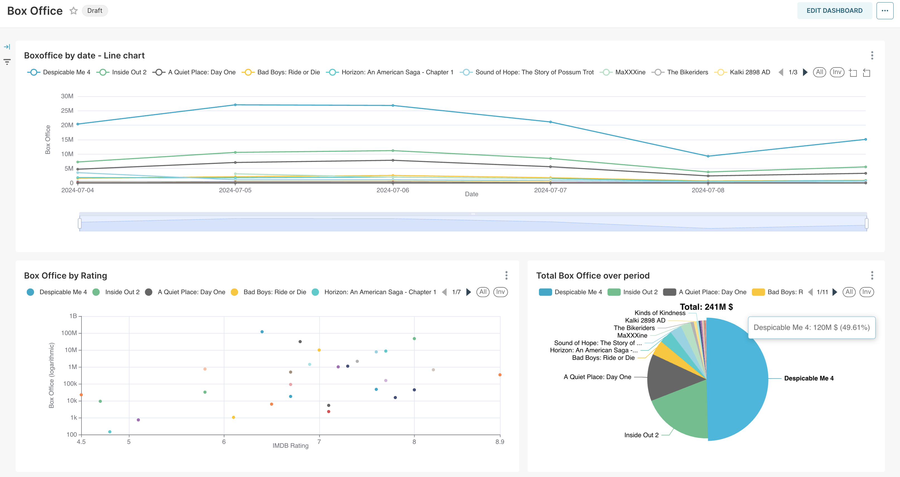

# ETL Pipeline and Visualization of Box Office Data

## Overview

This project demonstrates a data engineering pipeline using Docker containers for Airflow, Kafka, Postgres, Spark, and Superset.

1. Containers are set up and tuned via Docker.
2. Box Office statistics from the previous 14 days are extracted from *boxofficemojo.com* via Airflow and sent to Kafka.
3. JSON data is streamed from Kafka to Spark, then preprocessed (transformation of columns) and loaded into a Postgres table.
4. A dashboard for visualization of Box Office statistics was set up preliminarily.

## Architecture

- **Airflow**: Orchestrates the pipeline.
- **Kafka**: Message broker for data streaming.
- **Spark**: Data downloading via streaming and data processing.
- **Postgres**: Data storage.
- **Superset**: Data visualization.




## Access
For both: *user* - **admin**; *password* - **admin**
- **Airflow**: http://localhost:8080/ 
- **Superset**: http://localhost:8088/

## Setup

1. Clone the repository
2. Build and run the containers using Docker Compose:
   ```sh
   docker-compose -f docker-compose.yml up --build  
3. Run 3 dags in sequence. 
   - *1-create_db_and_topic_test* - Checking Posgres and Kafka connections; 
   - *2-boxofficemojo_to_kafka* - Downloading data from *boxofficemojo.com* and sending to Kafka; 
   - *3-etl-pipeline_kafka_spark* - Fetching data from Kafka, processing and sending to Postgres
4. Log in to Superset and check visualization!



## Contact

Your Name - [Botov Ivan](mailto:mr.krat11s@gmail.com)

Project Link: [https://github.com/ivbotov/DE_projects/ETL_pipeline_boxofficemojo](https://github.com/ivbotov/DE_projects/ETL_pipeline_boxofficemojo)
